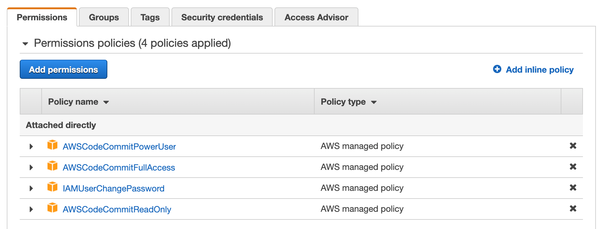
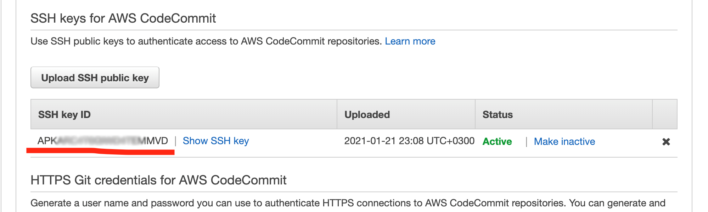

# Connecting to Private Repository via SSH

### Using Direct SSH Key

If you use a private repository using an SSH Key, you need to have an SSH key pair ready and enter your private key to Appcircle so Appcircle can access your repository.

:::caution

For the SSH key field in the repository connection, the private key is required. The public key is entered/stored in the Git provider while the private key is entered in Appcircle.

:::

To generate a new key pair, you can run the following command:

```bash
ssh-keygen -t rsa -b 4096 -P '' -f ./appcircle-ssh -m PEM
```

Two files will be created as `appcircle-ssh.pub` (Public key) and `appcircle-ssh` (Private key)

You can then run the `cat ./appcircle-ssh`  command and enter its output to Appcircle and run the  `cat ./appcircle-ssh.pub` command and enter its output to the SSH keys section of the Git provider.

Select **Connect via SSH **through the connection selection

.png>)

Then, enter your relevant information to connect to the private repository:

.png>)

After the connection is successful, you can [view your newly created profile](https://docs.appcircle.io/build/adding-a-build-profile#view-the-newly-created-build-profile) and start building!

:::info


To enable triggered auto builds with webhooks for SSH repository connections, please refer to the following guide: [Build Manually or Automatically with Webhooks and Triggers](../build-manually-or-with-triggers.md)

:::

:::caution

### Connection Notice

For Appcircle to connect to the Self Hosted GitLab Instance, your connection must be reachable over the internet.&#x20;

:::

Is your self-hosted GitLab instance under an enterprise firewall? Learn which IP addresses and ports Appcircle uses to function under the whitelist documentation:


[accessing-repositories-in-internal-networks-firewalls.md](../../infrastructure/accessing-repositories-in-internal-networks-firewalls.md)


### How to connect to AWS CodeCommit repositories through SSH?

AWS CodeCommit requires the creation of a dedicated user for repository connections through SSH (i.e. the root user cannot be used for this purpose).

* First, create a user in AWS IAM and assign the following permissions to the user:



* Go to IAM -> Users -> User -> Security credentials and select "Upload SSH key".
* Take a note of the SSH key ID generated by AWS as follows:



* Once you login with the newly generated user and copy the repository URL in SSH format, you will receive URL as follows: `ssh://git-codecommit.us-east-2.amazonaws.com/v1/repos/MyDemoRepo`
* For the SSH connection to be initialized, you need to add the public key to your URL to have it in the following format, which then can be entered in Appcircle to be used in SSH connections.`ssh://Your-SSH-Key-ID@git-codecommit.us-east-2.amazonaws.com/v1/repos/MyDemoRepo`

