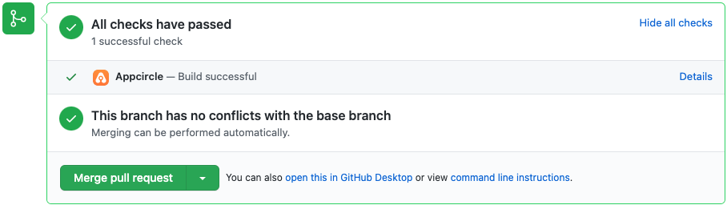

import ContentRef from '@site/src/components/ContentRef';

# Building Flutter Mobile Applications

You can build your Flutter applications in Appcircle for iOS or Android platforms.

### Creating a Flutter Build Profile 

Simply create a new build profile as usual and select your target operating system as iOS or Android. Select **Flutter **for **Target Platform**.

.png>)

Once your build profile is created, click on it and connect your Git repository. For details on this step, please follow the directions on the following page:

<ContentRef url="build/adding-a-build-profile">Adding a Build Profile</ContentRef>

To test drive the Appcircle platform for Flutter app builds, you can also use our sample Flutter App by forking it or adding it as a public repository: [https://github.com/appcircleio/appcircle-sample-flutter](https://github.com/appcircleio/appcircle-sample-flutter)

### Build Configuration for Flutter Applications 

Build configuration options are very similar to native iOS or Android applications. You can select configuration details, build triggers, signing identities and distribution options.

### Build Configuration for Flutter iOS applications 

Click on the gear icon on the top right to access the build configuration. The first step will be the entering project details. You can enter these details manually or click on the Fetch button to retrieve them from your project to detect the correct path for the Xcode project automatically.

Your iOS project needs to have an **Xcode project** or an **Xcode workspace** and a **shared scheme** to complete the build configuration successfully. Appcircle can fetch these workspaces and shared schemes from your branch automatically.

You can also select a specific Xcode version if you have certain dependencies or if you want to test your build on a specific version.

.png>)

### &#x20;

### Build Configuration for Flutter Android applications 

Click on the gear icon on the top right to access the build configuration. For Flutter Android apps, the fetch operation is not required. You can simply select the build mode (e.g. debug or release) and the output type (APK or Splik APK as AAB).

.png>)

### Build Configuration for Flutter Web applications 

Flutter Web apps are built alongside with iOS or Android Flutter apps. For more information please refer to the following guide:


[building-flutter-web-applications.md](building-flutter-web-applications.md)


### Sending the Build Status to the Repository Providers

At the bottom of the config tab, you will the **Set Commit Build Status **option.

.png>)

When this option is enabled, the build status for that commit is shared with the repository provider.

.png>)

### Build Triggers 

The next section, Triggers, is common for both iOS and Android.

Appcircle allows you to trigger builds manually or automatically using build triggers.

- On push: Whenever code is pushed to a configured branch, the build is triggered.
- On a tagged push: Whenever a tagged commit is pushed, the build is triggered for that commit. Commits without any tags are ignored.
- On push with selective tags: Whenever a commit includes one of the typed in tags, the build is triggered. You can specify tags with Unix shell-style wildcards to trigger builds.


[build-manually-or-with-triggers.md](build-manually-or-with-triggers.md)


###

### Signing Flutter iOS Applications

The next step in the build configuration is Signing. Here, please select the provisioning profile you added in the [iOS Certificates & Provisioning Profiles](../signing-identities/ios-certificates-and-provisioning-profiles.md) section.

For signing iOS apps, press add, select the bundle ID from the first dropdown and then select a compatible provisioning profile (added from the signing identities module) from the second dropdown.

.png>)

### Signing Flutter Android applications 

Here, please select the Android Keystore you added in the [Android Keystores](../signing-identities/android-keystores.md) section. For signing Android apps, simply select a keystore (added from the signing identities module).

.png>)

###

### Distribution (Deployment) Configuration

The next step on build configuration is Distribution.

You can select a previously created distribution profile or create a new one in this window. Use the top input box to enter a name for the new distribution profile you want to create. Press enter or click on the green + icon on the right to create the distribution profile.

Finally, check Auto Distribute if you want your build to be deployed to the Testing Distribution automatically and Auto Deployment if you want the build to be deployed to Store Submission automatically.


[Broken link](broken-reference)


:::info

Any previous build can be deployed to the Distribute module without the need for rebuilding.

:::

### &#x20;

### Environment Variables 

The final tab is to add environment variables to the build. For advanced use cases, you can define variables and secrets to be incorporated during the build in the Environment Variables submodule so that you don’t need to store certain keys and configurations within the repository.

Please refer to the following document for more information on environment variables:


[Broken link](broken-reference)


### Build Workflows for Flutter Applications

Once you complete your build configuration, you can edit your build workflow. Flutter builds have additional steps for Flutter commands. You can also arrange, add or remove workflow steps using Appcircle's workflow editor and Workflow Marketplace.

.png>)

To learn more about Appcircle's Workflow editor, see the corresponding page below:

<ContentRef url="../workflows/why-to-use-workflows">What are Workflows and How to Use Them?</ContentRef>

### How to Set a Specific Flutter Version for the Build

To change the Flutter version, open the Flutter Install workflow step from the workflow editor and set the version under the "Selected Flutter Version" field.

.png>)

### Starting a Flutter Build and After a Build

To start your first build, just press the start build button – the play button under the actions columns (or push some code to your repo if autobuild is configured.) You will see the build progress and the log in realtime.

Once your build is complete, you can now download the binary file or deploy it to distribute module manually (if autodistribute is enabled, it will be sent automatically after a successful build). You can also view or download your build logs at anytime.

.png>)
