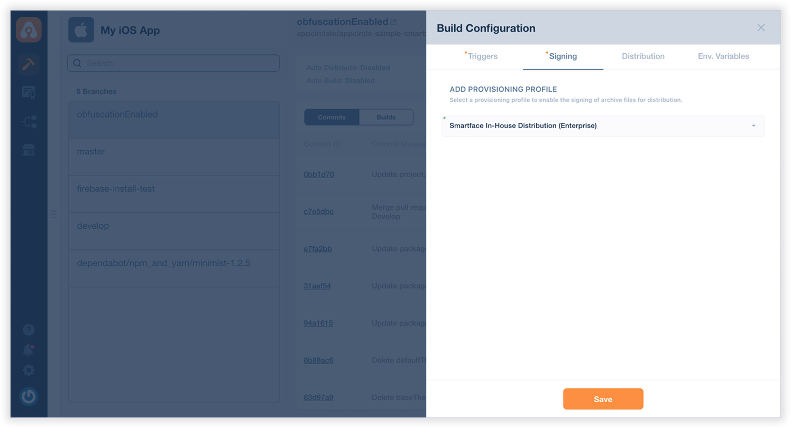
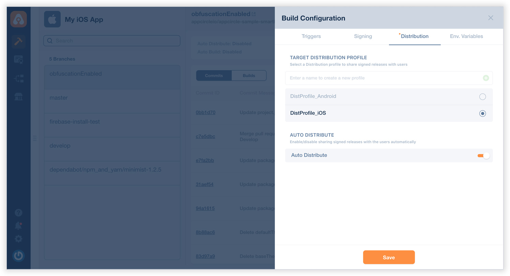
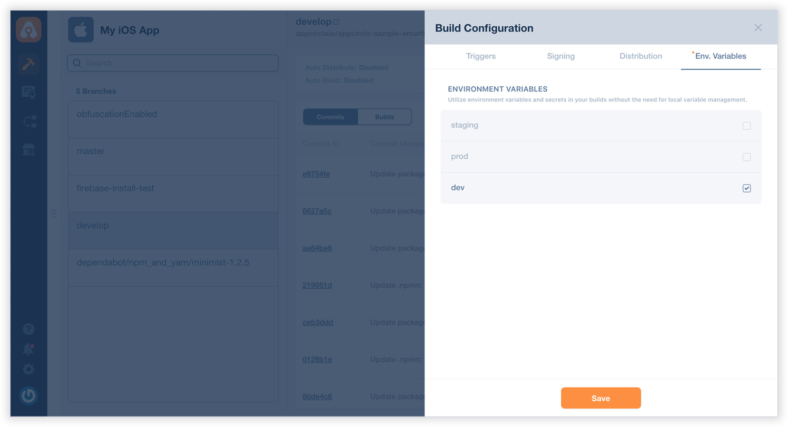
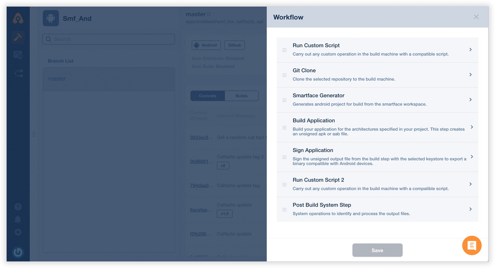
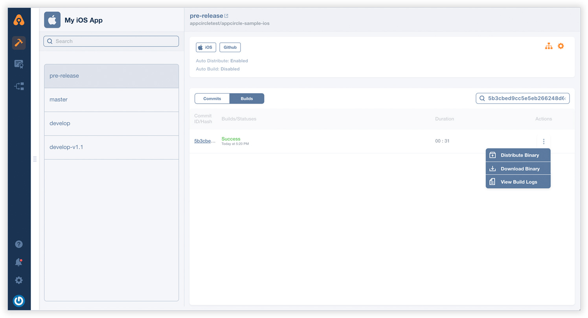

# Building Smartface Projects

Once your build is complete, you can now download the binary file or deploy it to distribute module manually (if autodistribute is enabled, it will be sent automatically after a successful build).

You can also view or download your build logs anytime.Smartface builds work very similar to any iOS or Android builds. Appcircle can build mobile applications developed with Smartface Cloud IDE flawlessly.&#x20;

Smartface projects are single-code based and can be built into both iOS and Android applications using Appcircle.

:::caution

Please note that you need to create separate build profiles for iOS and Android outputs for the same Smartface project.

:::

### Build Configuration

The overall workflow for Smartface builds is almost the same as the iOS and Android build steps explained earlier.&#x20;

### Triggers

You don't have to specify project meta data for Smartface projects. Only specify build triggers here.

.jpg>)

###

### Signing

In the Signing page, select the proper signing certificates for iOS or Android applications.

###

### Distribution

On the Distribution page, create a new distribution profile or select a previous profile you created earlier. You can also enable auto distribution feature if you need to.


[Broken link](broken-reference)


:::info

Any previous build can be deployed to the Distribute module without the need for rebuilding

:::

###

### Environment Variables

You can define variables and secrets to be incorporated during the build in the Environment Variables submodule so that you don't need to store certain keys and configurations within the repository.

Please see the following page for more information about environment variables:


[Broken link](broken-reference)


Please click on the Save button and close this modal.

###

### Workflow Editor

You can use the workflow editor for in-depth configuration of all build steps. Please click on the workflow icon to open and use workflow editor.

:::info

Any custom operation during the build can be executed through the Custom Script step in the workflow.

:::

For details on using Appcircle's workflow editor, please see the related page below:


[why-to-use-workflows.md](../workflows/why-to-use-workflows.md)


### Start Build

You are now ready to start your first build.

At the build profile page, you can see your branches are listed on the left and commits on the right.

.jpg>)

You can start the build by clicking on the arrow icon to the right of each commit.

Appcircle will start building your application. Build log window will open and you can follow build process in realtime.

:::info

You can safely close the build log window, it won't affect the status of your build. You can come back and click on the build to track the status of your build.

:::

.jpg>)

Your build will be distributed automatically if you had set up auto build earlier. You can also manually distribute builds at any time you like.


[after-a-build.md](after-a-build.md)


