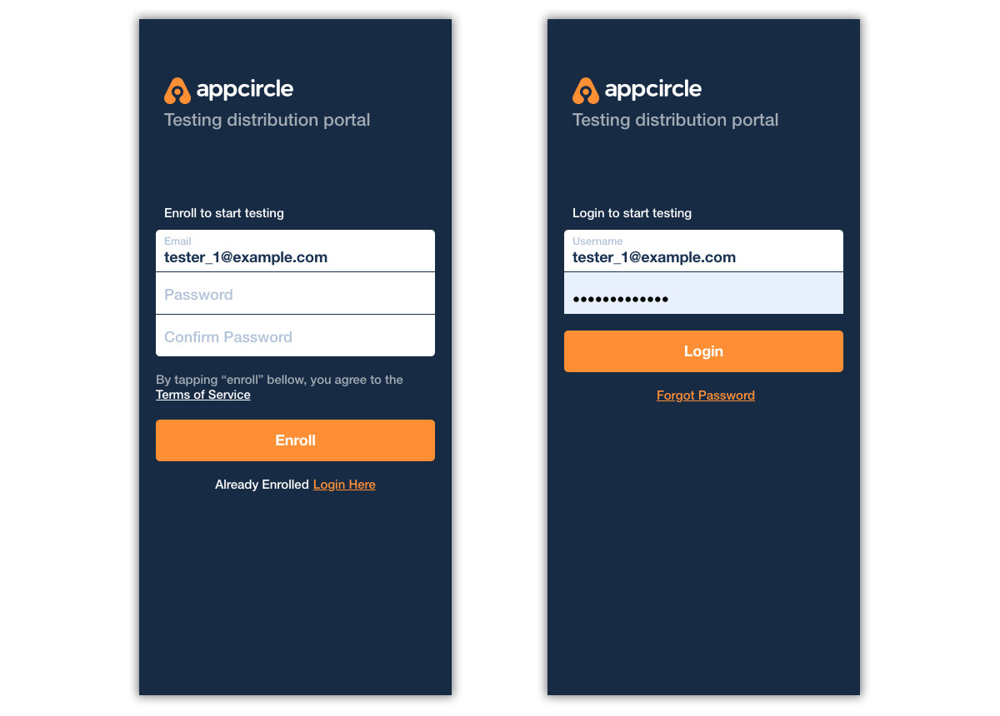
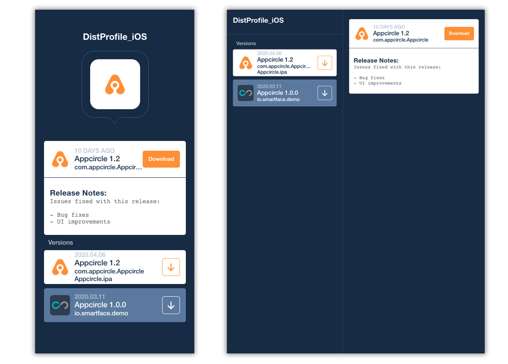

# Testing Portal: Logging in and Downloading Binaries

Appcircle has a separate distribution screen designed to make it easy for test group developers and testers download the distributed applications easily.

For iOS and Android, the testers can login from the link shared and then view all the versions shared with them. Downloading iOS and Android binaries are done through the specific flows of each OS.

When a build is shared with testers, each tester will receive an email with a link to download the binary file and other details like version number and release notes.

When the link is clicked, users will then be redirected to the distribution portal.&#x20;

If your distribution requires enrollment, users will be asked to create an enrollment account. If your distribution requires a login, users will be asked to log into the distribution portal.

:::info

The accounts used in the testing portal are completely independent from Appcircle accounts and only used for downloading shared apps.

:::

Once logged in, users can now distributions separated by distribution profile and release version. Files can be downloaded with one click.

:::caution

For running iOS apps signed with an enterprise certificate, you may need to trust the certificate provider after installing the app.

For installing Android apps, you may need to grant the web browser "install apps from unknown sources" permission so that the apps downloaded from the portal can be installed.

:::

